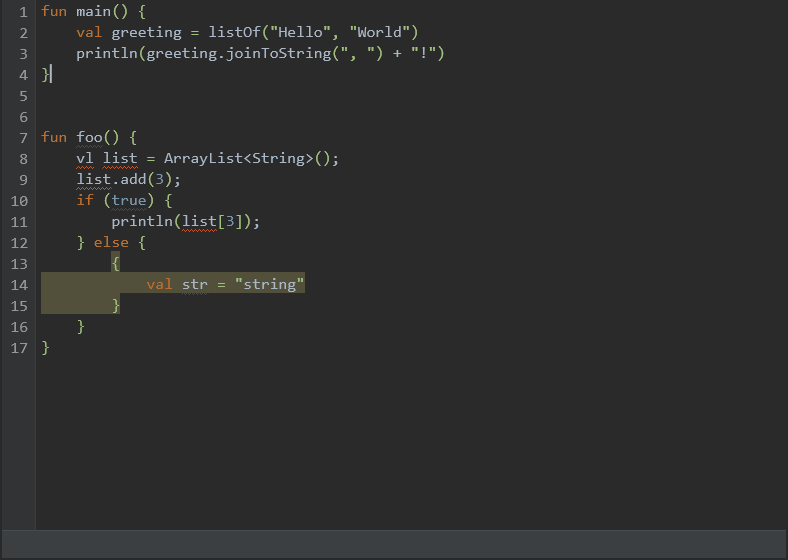

# Compose Code Editor

A desktop code editor app using Jetpack Compose for Desktop and IntelliJ Platform.

## Project Structure

The code is contained in the `component` folder. There are several modules:
- `:editor` - Compose Code Editor component code
- `:platform:api` - API of the platform that implements the IDE functions
- `:platform:lib` - API implementation based on IntelliJ Platform
- `:demo` - Demo as a desktop application

## Running demo application

Make sure that the `JAVA_HOME` environment variable is set before starting. For example, in macOS, just run: 
```shell
export JAVA_HOME=$(/usr/libexec/java_home)
```

Running application:

```shell
cd component
./gradlew :demo:run
```



## Features

- Auto-suggestion and code completion: `Ctrl+Space`
- Go to declaration: `Ctrl+B` (`cmd+B` on mac) or by click with `Ctrl` (`cmd` on mac)
- Search: 
  - `Ctrl+F` open the search bar
  - `Ctrl+Enter` return the focus to the editor
  - `F3`, `Shift+F3` move to the next, previous search result. The search bar also supports the `Up` `Down` `Enter` `Shift+Enter` keys for moving through search results
  - `Esc` close the search bar
- Functionality for highlighting code sections with the output of diagnostic messages

## Usage

### Initialization

Create an instance of the `Platform` and initialize it. Only one initialized instance can exist at runtime. The platform cannot be re-initialized after stopping.

```kotlin
val platform = createPlatformInstance()
platform.init()
```

### Creating project

Open a project or a separate file and get an instance of the `Project`.

```kotlin
val project = platform.openProject("/path/to/project")
val singleFileProject = platform.openFile("/path/to/file")
```

### Adding libraries

```kotlin
project.addLibraries("jars/kotlin-stdlib.jar")
```

If a directory is specified, all libraries from it and all its subdirectories will be loaded.

### Creating compose component

Create an instance of the `ProjectFile` that contains information about the project and the file to be edited.
And pass it to the `CodeEditor` component.

```kotlin
val projectFile = createProjectFile(
    project = project,
    projectDir = "/path/to/project",
    absoluteFilePath = "/file/to/edit"
)

CodeEditor(projectFile)

val singleFile = createProjectFile(
    project = singleFileProject,
    absoluteFilePath = "/path/to/file"
)

CodeEditor(singleFile)
```

### Closing project

```kotlin
project.closeProject()
```

### Stopping

```kotlin
platform.stop()
```

Closes all open projects and deletes temporary files.

### Diagnostic messages

The editor supports the output of diagnostic messages. 
To do this, pass the list of `DiagnosticElement` to the component.

